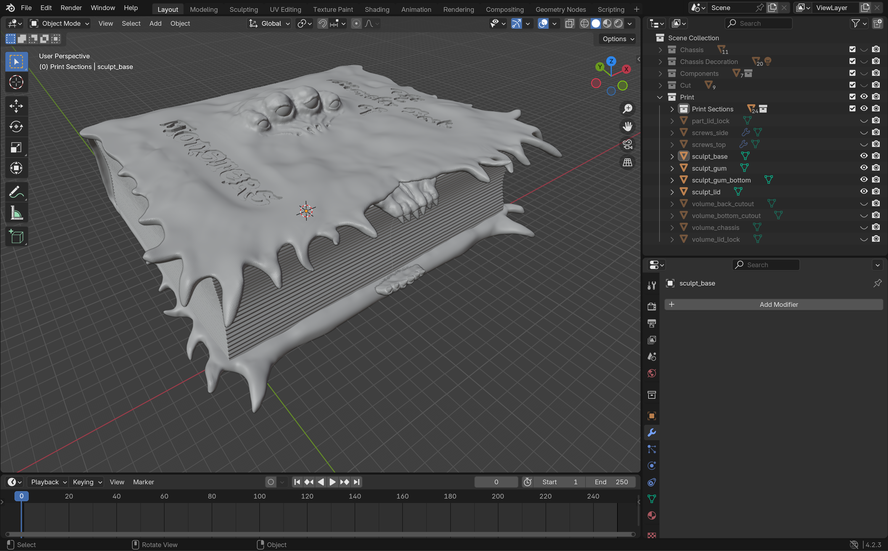

# ROBOWARS 2025



## Contributors
Finn Gross Maurer, Jørgen Lind Fløystad, Ida Margrete Tangen

## Disclaimer
This repository contains supplementary files and scripts for the Robowars 2025 project.

## Getting Started

If you do not have Blender installed, please download the latest version from [blender.org](https://www.blender.org/).  
If you find Blender useful, consider donating to support its development.

---

### Download the Blender File
The main Blender file exceeds GitHub’s upload limit (over 100 MB).  
You can download it separately from the following link:

📦 [robowars2025_blend.zip](https://jonekra.folk.ntnu.no/fildeling/git/supplement/Robowars/robowars2025_blend.zip)

---

### Using `export2dxf.py`

#### 1. Set up Python
If Python is not installed, download and install it from [python.org](https://www.python.org/).

#### 2. Create a Virtual Environment
Navigate to the same directory as the `.blend` file, then open a terminal.

Run the following command to create a virtual environment (recommended name: `venv`):

```bash
python -m venv venv
```

### Activate the Environment

Activate the environment:

- **Windows:**  
  ```bash
  venv\Scripts\activate
  ```
- **macOS/Linux:**  
  ```bash
  source venv/bin/activate
  ```

To deactivate the environment, type `deactivate` or simply close the terminal.

---

### Install Dependencies

Install the required libraries:

```bash
pip install ezdxf
```

(Optional but recommended):

```bash
pip install blender-stubs
```

If your virtual environment is active, its name (e.g., `(venv)`) will appear at the beginning of your terminal line.

> **Note:**  
> The script automatically detects a virtual environment named `venv`.  
> If you use a different name, you may need to update line 9 in the script accordingly.

---

### Running the Script in Blender

1. In Blender, open the **Text Editor** (top toolbar, far right).  
2. Click **Open Text** → select the script `export2dxf.py`.  
3. Run the script by pressing ▶ (Play) or using **Alt + P**.

The script exports the mesh edges of the selected object to a DXF file.

---

### Important Notes

- The script **only exports mesh edges** of the **selected Blender object**.  
- The object’s **base mesh must lie in the XY plane** — no unapplied rotation.  
- To fix orientation issues:  
  1. Move and rotate the object to align with the XY plane.  
  2. Select the object (highlighted **bright orange**).  
  3. Press **Ctrl + A → Apply → Rotation & Scale**.  
  4. If the Z dimension is not 0, set it manually to 0, then apply the scale again.  

The script assumes DXF models are created flat in the XY plane.

---
